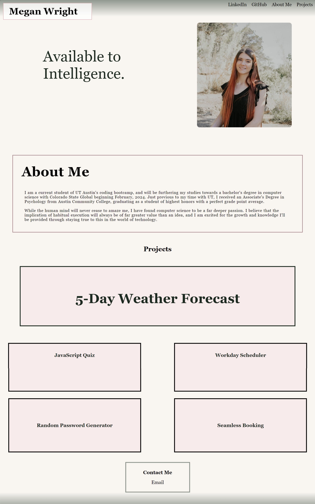

# Manifesting Megan

## Description

This page is all about the creation of Megan, the software developer. When on the page you are able to see an image of myself, an About Me section with a personal bio, links to deployed projects (currently placeholder images until applications completed), a contact section where the user can email or call me, and links to visit my GitHub and LinkedIn profiles. I am creating this portfolio to better-round my understanding of CSS and the ways in which it's used to create responsive design. I do feel as though this challange dramatically impacted my knowledge of CSS.

## Installation

There are no installation needs to interact with this application. A user will simpy require a computer and internet connection to view page contents. 

## Usage

The primary use of this website is to learn all about me! Learn about how I found my way into computer sceince through my About Me section and through reviewing my LinkedIn profile. See my skills put to the test in the works section of this website, where (in the coming future) you are able to learn of applications I have created. After having the chance to get to know me, you're able to give me a call (not currently active) or send me an email to introduce yourself and provide feedback (because I LOVE feedback!).

## Wire Frame

### Full(Regular) Screen

### Small Screen

